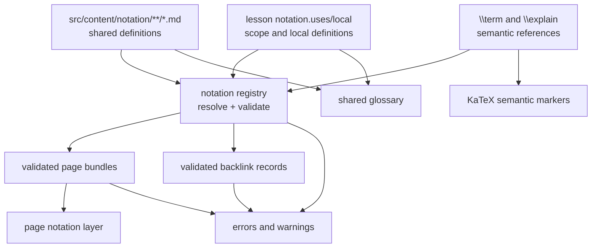
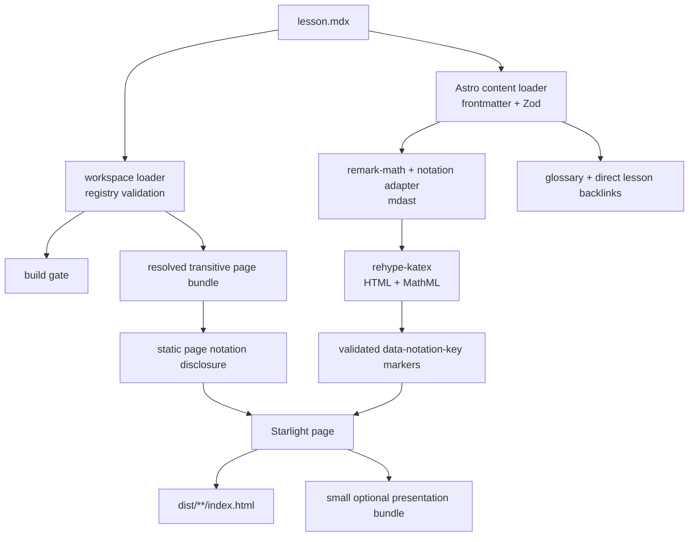
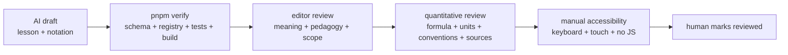

# Notation, explanations, and the build pipeline

Technical notes for the define-once/reference-many notation system. Editors
should start with the root `README.md`; the accepted decision is summarized in
`docs/adr/0002-notation-authoring.md`.

## 1. Implementation status

The production path now uses the existing Astro, Starlight, remark-math, and
build-time KaTeX pipeline. It does not use MathJax, a CDN, runtime math
rendering, or hand-written JavaScript explanation dictionaries.

Implemented in the current notation slice:

- a shared Markdown collection under `src/content/notation/`;
- schema-checked `notation.uses` and `notation.local` lesson frontmatter;
- MDX prose `\term\{key\}` references, normalized by the parser to
  `\term{key}`, and math `\explain{key}{latex}` annotations;
- lexical local-then-shared scope;
- nested math annotations;
- deterministic registry validation, page bundles, and basic backlinks;
- curriculum-alignment and review-state checks;
- a narrowly trusted KaTeX `data-notation-key` marker;
- build-time HTML and MathML;
- a static page notation disclosure and shared glossary;
- optional hover, focus, tap, and pin presentation behavior.

Deliberately deferred:

- `\explain[def]`, `:::def`, and equation-local definition syntax;
- a generated JSON file or Vite virtual registry module;
- richer recursively nested panel bodies;
- automatic per-equation notation tables;
- automated round-trips from notation examples to `src/domain/` functions.

The old `src/pages/test_equation.astro` prototype, if retained while migration
is reviewed, is only a historical interaction sketch. Its MathJax/CDN and
inline dictionary approach is not part of the site architecture.

## 2. Author-owned inputs

There are three explicit inputs.

### Shared definitions

One Markdown file under `src/content/notation/` owns a reused meaning. Its
frontmatter includes:

```yaml
key: discount-factor
notation: 'D(0,t)'
title: Discount factor
aliases:
  - present-value factor
domain: rates
units: current currency-units per future currency-unit
perspective: Converts a deterministic future unit to valuation time.
sources:
  - tuckman-serrat-fixed-income
seeAlso:
  - valuation-time
  - payment-time
alignment:
  kind: competency
  introducedByCompetency: rates.discount-factor.interpret
  introducedInLesson: foundations.discount-factors
editorialStatus: draft
aiAssisted: true
```

The body contains the explanation and may itself use `\term{...}` to reference
other shared definitions. The first paragraph is suitable for the compact page
layer; the complete rendered body belongs in the glossary.

### Lesson imports and local definitions

Lessons import reusable entries and own page-specific bookkeeping in
frontmatter:

```yaml
notation:
  uses:
    - discount-factor
    - payment-time
  local:
    - key: discounting-payment-index
      notation: k
      title: Discounting payment index
      summary: Selects one payment and its matching discount factor.
      details: The index is bookkeeping; t_k is the time in years.
      formula: 'k \in \{1,\ldots,n\}'
      sources: []
      seeAlso:
        - payment-time
      alignment:
        kind: general
        rationale: Finite indexing is part of the track entry assumptions.
```

`uses` lists shared imports only. Local keys are automatically available in
that lesson and inherit its editorial status. When a second page needs a local
meaning, the editor promotes it to a shared collection entry rather than
copying it.

### References

MDX prose consumes a definition with escaped braces:

```md
The \term\{discount-factor\} converts one future unit to valuation time.
```

The escape is for MDX's expression grammar, not part of the semantic key. The
Markdown AST exposes normal `\term{discount-factor}` to the notation adapter.
Shared notation bodies use ordinary `.md`, so they author `\term{key}` without
brace escapes.

Math uses `$...$` or `$$...$$` delimiters and keeps semantic identity separate
from visual LaTeX:

```tex
\explain{discount-factor}{D(0,t)}
```

Annotations may nest:

```tex
\explain{signed-cash-flow}{CF_{\explain{payment-index}{k}}}
```

Do not use `\(...\)` or `\[...\]` as lesson math delimiters.

The nearest nested marker wins pointer hit-testing, while the outer expression
retains its own definition. Code spans, code blocks, MDX expressions, and raw
HTML are not rewritten. Bare math remains ordinary KaTeX without a semantic
target.

## 3. Registry construction and validation

The registry is a deterministic in-memory build product, not an author-edited
database or committed generated file.



Shared definition bodies can resolve only shared definitions. A page and its
local definition prose resolve local definitions first and then shared imports.
This is lexical scope; “most recently defined” and raw-glyph matching are never
used. `seeAlso` targets follow the same lexical/import checks but remain
navigational links, not dependency edges; reciprocal “see also” links therefore
do not create definition cycles or enlarge a page bundle.

Validation covers:

- invalid or duplicate keys and pages;
- duplicate or conflicting definitions;
- missing and duplicate shared imports;
- undeclared, undefined, and unused references;
- unused imports and unreachable definitions;
- definition-reference cycles, including nested definition prose;
- unknown competency and lesson alignment IDs;
- introduction order and alignment availability;
- inconsistent review states;
- deterministic page bundles and backlinks.

The page disclosure consumes the registry's resolved transitive bundle at
build time. The glossary consumes the schema-checked shared notation
collection directly. No generated registry file is committed; a generated or
virtual module remains deferred until it would materially simplify or speed up
the build.

Errors fail `pnpm validate:content`, `pnpm build`, and `pnpm verify`. Warnings
surface review debt without silently changing authored content.

## 4. MDX to static output



Intermediate artifacts remain the normal Astro outputs:

- `.astro/data-store.json` and `.astro/content.d.ts` for parsed collections;
- in-memory mdast, registry records, and hast during compilation;
- `dist/**/index.html` with equations, MathML, disclosures, and links;
- content-hashed JavaScript/CSS under `dist/_astro/` only for labs and optional
  notation presentation;
- `dist/pagefind/` for the final static search index.

A separate generated registry file is unnecessary at the current scale. If
build profiling later justifies one, it can be added without changing author
syntax or semantic rules.

## 5. KaTeX trust boundary

The `\explain` KaTeX macro expands to the equivalent of:

```tex
\htmlData{notation-key=<validated-key>}{<latex>}
```

KaTeX's trust callback accepts only `\htmlData` with exactly one
`data-notation-key` whose value matches the repository key pattern. It rejects
arbitrary HTML classes, IDs, styles, links, protocols, and additional data
attributes. The remark and registry stages separately ensure the key exists and
is in scope. Author-written `\htmlData` is rejected before KaTeX runs, so the
trusted marker can be reached only through a validated `\explain` call.

Math is still rendered at build time with `output: htmlAndMathml`. The marker is
presentation metadata on KaTeX's visual HTML; the MathML remains the accessible
mathematical representation. No financial formula is evaluated by the
notation layer.

## 6. Progressive rendering and interaction

The static page contains a native disclosure with a flat list of resolved
definitions and canonical links. Shared entries link to the glossary; local
entries link to their page anchor. This is the keyboard and no-JavaScript
baseline.

The optional browser adapter reads definition content already emitted into the
page. It does not fetch or author another registry. It may:

- highlight every occurrence of one semantic key;
- show a compact explanation on hover or focus;
- let pointer and touch users pin an explanation;
- keep the panel clear of the whole display equation;
- close on Escape or outside interaction.

Nested KaTeX markers remain pointer targets without creating nested buttons.
Flat controls in the page layer provide the accessible focus tree. If the
enhancement fails, the equation, MathML, static disclosure, and glossary links
remain usable.

## 7. Glossary and backlinks

The glossary renders shared notation collection bodies, not copies. It includes
the canonical symbol, title, aliases, domain, units or perspective, source IDs,
alignment, review status, `seeAlso`, and basic direct lesson backlinks derived
from validated `notation.uses` declarations.

Page-local definitions are not promoted into the shared glossary. Their
canonical home is the lesson that declares them. This keeps temporary sequence
indices from becoming misleading global concepts.

## 8. Division of responsibility

- **Editors:** shared/local choice, semantic key, glyph, explanation, units,
  perspective, sources, alignment, and reference placement.
- **Content schemas:** field shape and basic key/status constraints.
- **Notation registry:** lexical resolution, cross-entry semantics,
  diagnostics, bundles, and backlinks.
- **Remark adapter:** prose rewriting and math-reference inspection while
  skipping code and executable MDX regions.
- **KaTeX:** build-time HTML and MathML plus the narrowly trusted marker.
- **Starlight/Astro:** static layout, routing, glossary, disclosure, bundling,
  and search.
- **Browser adapter:** optional hover/focus/tap/pin presentation only.
- **`src/domain/`:** all financial calculations; it has no notation UI or DOM
  dependency.

## 9. Review and AI flow



Material AI assistance is recorded under `ai/provenance/`. AI-created shared
entries and materially changed lessons remain `draft`. The registry can prove
that references resolve; it cannot prove that a definition, convention,
formula, or source is financially correct. A human must verify those claims
and must not infer review from a passing build.

## 10. Future extensions

Preserve these ideas without treating them as current behavior:

- a generated JSON or virtual module if registry construction becomes costly;
- richer nested panels that render reviewed Markdown safely;
- automatic per-equation symbol tables and “introduced here” views;
- expanded backlink filtering by direct versus transitive use;
- tested numerical examples bound to `src/domain/` functions;
- compact alternative syntax if it retains explicit definitions and scope;
- an allowlisted component alias for labs to reduce fragile relative imports.

Inline definition creation remains intentionally deferred because it makes
duplicate meanings, missing provenance, and review-state drift too easy.
