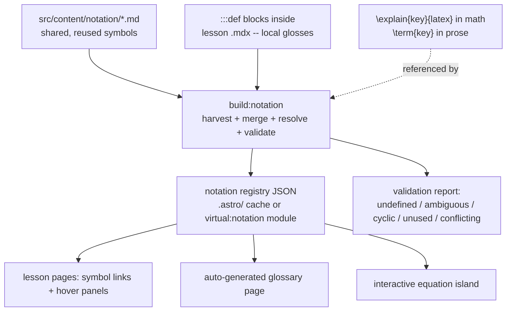
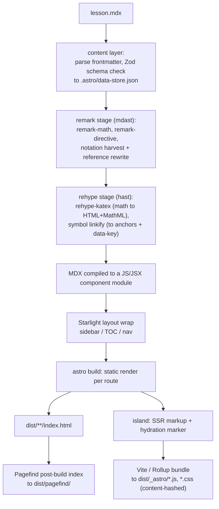
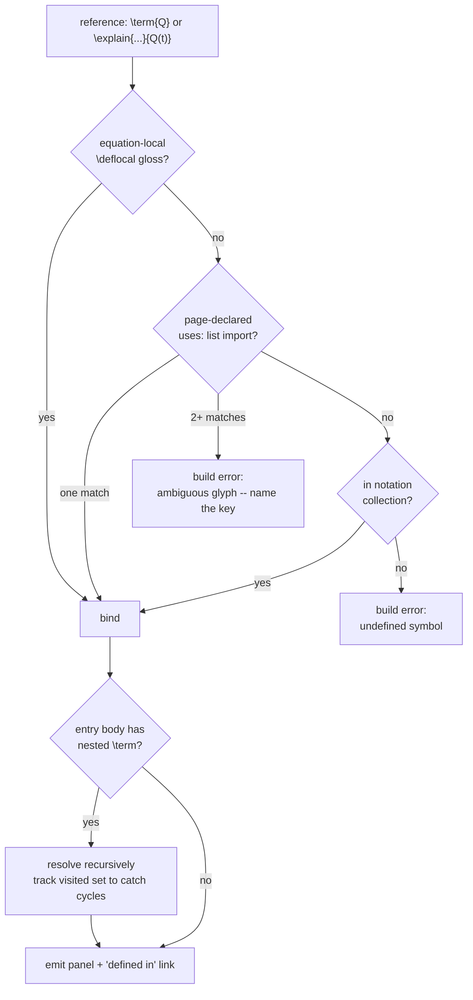
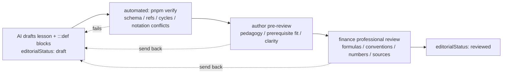

# Notation, explanations, and the build pipeline

Working notes for a define-once / reference-many system for mathematical
notation, and how it would sit inside the current Astro + Starlight build.
Nothing here is built yet; `src/pages/test_equation.astro` is a standalone
prototype that does not use the site pipeline.

## 1. What exists today

| Piece                                 | Role                                                                                                                                                                                                                           |
| ------------------------------------- | ------------------------------------------------------------------------------------------------------------------------------------------------------------------------------------------------------------------------------ |
| **Astro** (`output: 'static'`)        | Routing from the file tree, content collections + Zod schema checks, orchestration of remark/rehype, static HTML generation, island hydration, asset bundling via Vite, dev server.                                            |
| **Starlight**                         | Docs shell: sidebar, table of contents, search, page layout. Owns the `docs` collection loader.                                                                                                                                |
| **MDX**                               | The lesson format. `src/content/docs/**/*.mdx`. Frontmatter is schema-checked in `src/content.config.ts`.                                                                                                                      |
| **remark-math + rehype-katex**        | Math is rendered to HTML+MathML **at build time**. No math JavaScript is shipped.                                                                                                                                              |
| **React islands**                     | `src/components/labs/*.tsx`, imported into MDX and hydrated with `client:visible`. Interactivity only.                                                                                                                         |
| **`src/domain/*.ts`**                 | Pure, typed, tested math. Imported by islands and by Vitest. Never imports React, Astro, or DOM.                                                                                                                               |
| **`scripts/validate-curriculum.ts`**  | Build-time semantic validation across collections (unknown IDs, cycles, ordering). Run by `pnpm build` and `pnpm verify`.                                                                                                      |
| **Prototype** (`test_equation.astro`) | Loads **MathJax from CDN** and hand-writes `variableExplanations` objects in inline `<script>`. Diverges from the real pipeline (which is KaTeX, build-time). Treat it as a sketch of the _interaction_, not the architecture. |

## 2. Where the explanation database comes from

The database is a **build artifact**, never hand-maintained. It is assembled
from content the author already writes:

- **Shared symbols** -- one file per reused quantity in a new
  `src/content/notation/` collection (`pricing-measure.md`,
  `survival-probability.md`, ...). Frontmatter: `key`, `notation`, `aliases`,
  `domain`, `sources`, `seeAlso`, `editorialStatus`, `aiAssisted`. Body: the
  explanation prose, which **may itself contain `\term{...}` references** to
  other entries.
- **Local glosses** -- `:::def{key=...}` blocks inside a single lesson's MDX,
  for symbols that only that lesson uses.
- **References** -- `\explain{key}{latex}` in math and `\term{key}` in prose.
  These consume entries; a bare first `\explain[def]{key}{latex}{one-line}` may
  also _create_ a trivial entry.

A `build:notation` step (sibling of `validate:content`) harvests all three,
merges them, resolves references, and emits:



**When:** at `pnpm build`, and on dev-server start / file watch.
**From what:** the `notation` collection + `:::def` blocks + `\explain`
payloads. **Consumed by:** the rendered pages, the generated glossary, and the
equation island (as props / embedded JSON -- not a hand-written object).

## 3. MDX to HTML: steps and intermediate forms



Intermediate artifacts you can actually find:

- `.astro/data-store.json`, `.astro/content.d.ts` -- parsed + validated
  collection entries and their generated types.
- In-memory only: **mdast** (Markdown AST, where remark plugins run) then
  **hast** (HTML AST, where rehype runs). The notation harvest and the
  math-to-KaTeX conversion happen here.
- `dist/**/index.html` -- one directory per route.
- `dist/_astro/*.js` / `*.css` -- hydration bundles for islands
  (`BondPriceExplorer.<hash>.js`, `react.<hash>.js`) and KaTeX fonts.
- `dist/pagefind/` -- search index built from the final HTML.

## 4. Astro's job vs. our JavaScript's job

- **Astro / Starlight (build time):** file-tree routing, schema validation,
  remark/rehype orchestration, layout, static HTML, island hydration wiring,
  Vite bundling, dev HMR.
- **remark-math + rehype-katex (build time):** all math rendering. Nothing math
  ships to the browser.
- **Build scripts (`tsx`, build time):** cross-collection semantic checks;
  proposed `build:notation` harvest + merge + reference resolution.
- **Our React island JS (browser):** lab controls and state only. The formula
  itself is a call into `src/domain/`.
- **Our equation-enhancement JS (browser):** hover / focus / pin / position the
  explanation panel; read the registry JSON embedded in the page. Pure
  presentation -- no formula logic, no definitions authored here.
- **`src/domain/` (isomorphic, pure):** the math. Imported by islands and
  tests; never touches the DOM.

## 5. Adding an interactive island to an MDX lesson

After the frontmatter, import the (allowlisted) component, then use it as JSX
with a hydration directive:

```mdx
---
title: ...
---

import BondPriceExplorer from '../../../components/labs/BondPriceExplorer';

## From contract to cash flows

...prose and $math$...

<BondPriceExplorer client:visible />
```

`client:*` picks when the island hydrates: `load`, `idle`, `visible`
(used here), `media`, `only`. Astro renders the component's SSR HTML at build
and ships a matching bundle in `dist/_astro/` that hydrates it in place.

_Friction worth removing:_ the `../../../components/...` path is error-prone for
an AI author. A tsconfig path alias (`@labs/*`) or auto-injecting approved
components via a remark plugin lets the author write only the tag.

## 6. Reference semantics: scoping, nesting, and links

**Scoping** -- resolve like lexical scope with imports, not "most recent wins":



**Nesting** -- an entry explains itself using other entries (`survivalProb`'s
body references `pricingMeasure`). The panel for `Q(t)` then carries
`pricingMeasure` as its own nested hover/link. A visited-set guards against
definition cycles; a cycle is a build error listing the path, exactly like the
competency-graph cycle check.

**Home link** -- every entry records where it is canonically defined (a
`notation/` page, or the lesson section holding its `:::def`). Each reference
renders as an anchor to `#def-key`: hover shows the panel, click jumps to the
full treatment with worked examples and context. This also gives free
backlinks ("used in these lessons") on the definition page.

## 7. Review flow (AI draft -> author -> finance professional)



Three cheap filters in series: mechanical errors never reach a human; the
author checks teaching; the professional checks correctness. Notation entries
carry their own `editorialStatus`, so a lesson referencing an unreviewed term
is visible in validation output.

## 8. Human- and token-friendliness checklist

- **Terse reference syntax** -- `\term{pricingMeasure}` or `[[pricingMeasure]]`:
  short, greppable, no closing tag, cheap for an AI to emit.
- **Convention over schema for panel slots** -- first paragraph = short, rest =
  long, first display math = formula. Nothing to memorize.
- **One concept per file, referenced by ID** -- small diffs, localized review;
  matches how competencies and sources already work.
- **A canonical symbol list** (extend `docs/notation-and-units.md`) given to
  the AI as context so it reuses `pricingMeasure` instead of coining
  `riskNeutralMeasure`.
- **Definitions cite `sources`** from the existing collection -- the finance
  reviewer verifies a citation once, centrally.
- **Generated artifacts** -- per-lesson notation table, site glossary, "symbols
  introduced here". The AI writes prose; the tables cannot drift and need no
  review.
- **Fail the build on undefined / ambiguous / duplicated-with-different-text**
  references. No silent `console.warn` like the prototype. Duplicate-with-
  conflict forces promotion to a shared `notation/` entry.
- **Round-trip with `src/domain/`** -- an entry's `formula` and numeric example
  can reference tested domain functions, so "do the numbers check out" is
  partly automated.
- **Progressive enhancement** -- `:::def` blocks render as visible prose; JS
  only collapses them into panels. Better with JS off than the prototype's
  "needs JavaScript".

## 9. Open decisions

- **Symbol markers through KaTeX.** The prototype's `\explain` relies on
  MathJax's HTML extension. In the KaTeX pipeline, either (a) define `\explain`
  to expand to `\htmlData{key=...}{...}` with `trust` enabled and pick it up in
  a rehype pass, (b) post-process KaTeX output in rehype by matching markers,
  or (c) move the site to MathJax. Option (a) keeps the current build.
- **Registry delivery.** A generated file under `.astro/` vs. a
  `virtual:notation` module vs. a real generated collection entry.
- **Entry home.** Co-locate each shared symbol with the lesson that first
  teaches it (like `teaches` competencies) vs. a flat `notation/` collection.
- **Scope source.** Derive a page's in-scope symbols from an explicit
  `uses:` frontmatter list vs. from its `requires`/`teaches` competencies.
