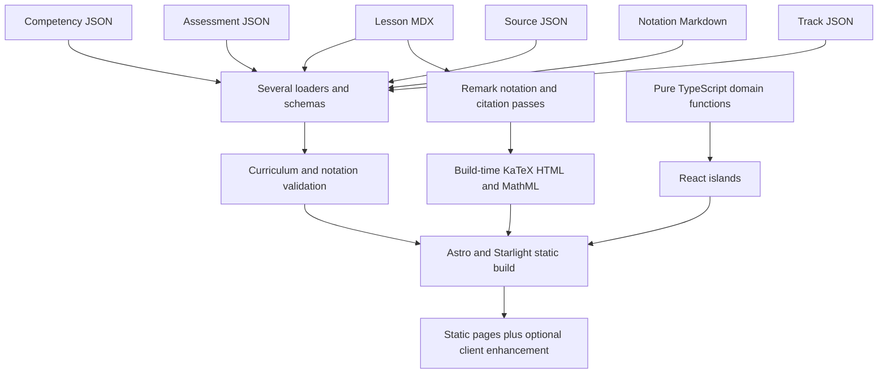
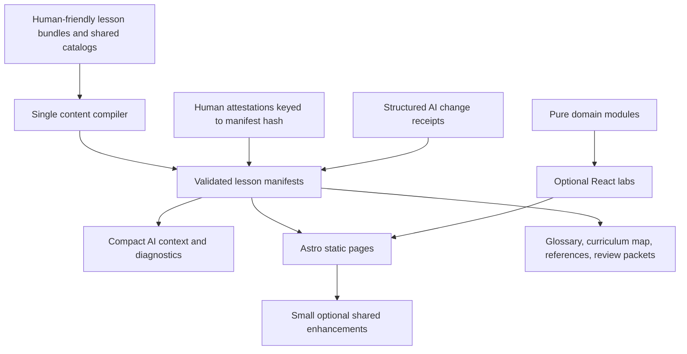

# Codex repository inventory and lean rebuild blueprint

> Status: draft planning document. AI-assisted on 2026-08-31; human
> architecture, editorial, and quantitative review are still required.
>
> Snapshot: repository commit `fe3b0ab` on 2026-08-31. Counts and implementation
> claims below describe that snapshot, not a permanent source of truth.

## Executive decision

Writing this inventory before doing more implementation is the right move.
Rebuilding everything in one pass is not.

The current repository contains valuable safeguards: structured sources,
competency prerequisites, semantic notation, deterministic calculations,
accessible static fallbacks, and substantial tests. Its main problem is that
the same contract is repeated across too many guidance files and implemented by
several independent loaders and validators. Some plans are also documented as
if they already exist.

The recommended approach is:

1. Keep the current repository as an executable reference.
2. Build a small version-two skeleton beside it or on a dedicated branch.
3. Port one complete lesson slice and compare behavior.
4. Migrate the remaining lessons one at a time.
5. Remove the old implementation only after parity checks and human review.

Optimize the context supplied to an AI, not file count by itself. One file per
lesson or reusable definition is often good for humans and diffs. Repeated
policy prose, duplicated schemas, and full-repository context are the expensive
parts.

## Product goal

The rebuilt repository should support this loop efficiently:

```text
human task + approved sources + conventions
                 ↓
compact machine-generated lesson context
                 ↓
AI draft or narrowly instructed correction
                 ↓
targeted schema, reference, math, and model checks
                 ↓
human editorial + quantitative review
                 ↓
hash-bound approval and full verification
                 ↓
accessible static lesson with optional interaction
```

Success means:

- a human can edit a lesson without understanding the build internals;
- an AI can retrieve only the relevant lesson, definitions, sources, models,
  tests, and diagnostics;
- every mathematical variable is defined or compilation fails at its exact
  source location;
- readers can reach definitions, assumptions, sources, and review status
  without JavaScript;
- calculations are typed, deterministic, and independent of UI components;
- every supported behavior has an automated test at the lowest reliable layer;
- AI work cannot approve itself or silently retain a stale human review.

## Current repository at a glance

| Item                                | Current count or state                             |
| ----------------------------------- | -------------------------------------------------- |
| Ordered learning tracks             | 1                                                  |
| Lessons                             | 8                                                  |
| Other content pages                 | Home, curriculum map, glossary                     |
| Atomic competencies                 | 17                                                 |
| Assessment sets / items             | 8 / 34                                             |
| Evidence split                      | 17 direct / 17 transfer                            |
| Item types                          | 14 numeric / 20 single-choice                      |
| Shared / local notation definitions | 21 / 9                                             |
| Registered sources                  | 3                                                  |
| Educational review state            | All `draft`                                        |
| Pure financial models               | Present value and a simplified fixed-coupon bond   |
| Stateful labs                       | Discounting explorer and bond price/yield explorer |
| Learner progress persistence        | Not implemented                                    |
| Static output                       | Implemented with Astro/Starlight                   |

The supported runtime is Node 24.20.0 through pnpm 11.24.0. A full verification
of this snapshot was observed to pass under Node 26.5.1 with an expected engine
warning; the supported Node 24 runtime remains the proper release gate.

## Current system map



The intended boundaries are sound:

- content owns explanations and curriculum relationships;
- `src/domain/` owns calculations;
- Astro owns static pages;
- React owns isolated stateful interactions;
- browser code enhances, but does not define, notation or citations.

The complexity comes from how many times those inputs are parsed and how much
behavior accumulated around notation and page chrome.

## Complete current feature inventory

Status labels used below:

- **Implemented**: evidence exists in current code and tests.
- **Partial**: visible behavior exists, but part of its declared contract does
  not.
- **Planned**: described in policy or an ADR but absent from code.
- **Legacy**: still present or routable, but explicitly outside the accepted
  architecture.

### Site and content shell

| Status      | Feature                             | Evidence and limits                                                                                                      |
| ----------- | ----------------------------------- | ------------------------------------------------------------------------------------------------------------------------ |
| Implemented | Static documentation site           | Astro/Starlight, static output, generated navigation, and production build in [`astro.config.mjs`](../astro.config.mjs). |
| Implemented | Eight-lesson foundations/bonds path | Four foundations lessons followed by four fixed-rate bond lessons under [`src/content/docs/`](../src/content/docs/).     |
| Implemented | Reference pages                     | Generated curriculum map and notation glossary.                                                                          |
| Implemented | Selective client hydration          | Interactive components use `client:visible`; ordinary lesson prose is static.                                            |
| Implemented | Educational disclaimer              | Root and lesson content clearly limit the project to simplified education.                                               |
| Partial     | Review status visibility            | Status exists in metadata and some notation/citation UI, but lesson status is not consistently displayed to readers.     |
| Planned     | Credit, CDS, CDX, and option tracks | Named in the roadmap, but not current lesson/model functionality.                                                        |

### Structured content and curriculum

[`src/content.config.ts`](../src/content.config.ts) defines six collections:
documents, competencies, assessments, tracks, sources, and notation.

Implemented curriculum checks in
[`src/curriculum/validation.ts`](../src/curriculum/validation.ts) include:

- valid and unique IDs;
- known prerequisite, lesson, assessment, source, and track references;
- competency self-prerequisites and cycles;
- prerequisite order within a lesson's ordered `teaches` list;
- track readiness and lesson order;
- numeric-answer finiteness and positive tolerance;
- single-choice correct-answer existence;
- globally unique assessment item IDs;
- minimum assessment count and transfer evidence for taught competencies;
- two-way synchronization of lesson citations and declared source IDs;
- reviewed lesson to reviewed source consistency;
- a nonempty assumption list for lessons that teach competencies.

The generated [`CurriculumMap.astro`](../src/components/CurriculumMap.astro)
shows track order, entry assumptions, prerequisites, taught competencies,
assessment IDs, and the atomic competency catalog.

Partial or missing enforcement:

- assessment coverage is global, so an unreferenced assessment set can satisfy
  a competency;
- an assessment associated with one lesson is not required to measure a
  competency that lesson teaches;
- `requiresUnassistedPass` is stored but not consumed;
- "independent" evidence is counted, not proven or grouped independently;
- duplicate lesson assessment/source references and duplicate choice option IDs
  are not comprehensively rejected;
- orphan competencies, assessments, notation, or sources are not uniformly
  reported;
- reviewed lessons are not required to have reviewed competencies and
  assessments;
- `NEEDS_SOURCE` and AI provenance are not validation gates;
- a material edit does not automatically invalidate a manual `reviewed` value;
- `riskTier`, `estimatedMinutes`, `lastReviewed`, competency misconceptions,
  and several collection statuses are stored but do little or nothing in the
  current UI/workflow.

### Assessments and learner state

The README is stale here. Assessments are rendered now:

- every lesson imports
  [`AssessmentSet.astro`](../src/components/assessments/AssessmentSet.astro);
- [`AssessmentRunner.tsx`](../src/components/assessments/AssessmentRunner.tsx)
  renders numeric and single-choice items;
- learners can open a question, submit an answer, see correct/revisit state,
  read the explanation, retry, and see an in-memory score.

The implementation is partial because:

- answer state is lost on navigation or reload;
- there is no `ProgressRepository` or versioned local-storage adapter;
- competency IDs and unassisted-pass policy do not drive learner progress;
- the custom question disclosure has no equivalent working no-JavaScript
  interaction;
- formulas inside assessment strings are plain text and outside semantic math
  validation;
- each lesson repeats the assessment ID in frontmatter, an import, a component
  call, and similar prose instead of deriving the section from one declaration;
- there are no focused assessment interaction tests.

### Sources and citations

Implemented behavior:

- structured source records under [`src/content/sources/`](../src/content/sources/);
- source types, bibliographic metadata, access date, URL/ISBN, license notes,
  and review status;
- inline `\cite\{id\}` and `\cite\{id\}\{locator\}` authoring;
- first-appearance numbering of each distinct source/locator pair;
- a static superscript link and generated References list;
- a JavaScript-free anchor/backlink baseline;
- optional hover, focus, tap, pin, and Escape behavior through
  [`CitationLayer.astro`](../src/components/citation/CitationLayer.astro);
- validation that every declared source is cited and every citation is
  declared;
- visible draft status for unreviewed references.

Complexity and gaps:

- source files are loaded independently in Astro configuration and content
  validation;
- the citation island serializes all sources into each lesson, not just cited
  sources;
- panel behavior duplicates much of the notation panel;
- per-use locator text and broad source-record locator metadata can overlap;
- the escaped brace syntax is noisy in MDX;
- source existence can be checked automatically, but locator accuracy still
  requires a human opening the actual source.

### Semantic notation and math

Implemented authoring and validation:

- 21 shared Markdown definitions and 9 lesson-local definitions;
- stable semantic keys independent of displayed LaTeX;
- shared imports through `notation.uses` and local definitions in lesson
  frontmatter;
- local-before-shared key shadowing;
- prose term links through `\term\{key\}` in MDX;
- explicit `\explain{key}{latex}` support, although current lessons use none;
- automatic canonical and unique-base matching for ordinary lesson LaTeX;
- compiler failure for unresolved or ambiguous identifier atoms;
- definition/reference, import, cycle, source, curriculum alignment, review
  state, bundle, and backlink validation;
- deterministic transitive page bundles;
- build-time KaTeX HTML and MathML;
- a narrow trust callback permitting only validated notation and lab-slot data
  markers;
- fatal handling of KaTeX's otherwise recoverable error markup;
- a static per-page notation disclosure and generated shared glossary;
- optional hover, focus, tap, pin, highlighting, Escape/outside dismissal, and
  article-aware positioning;
- a server-rendered lab-math adapter whose React client replaces only inert
  numeric slots.

Implemented behavior is spread across
[`src/notation/`](../src/notation/),
[`src/components/notation/`](../src/components/notation/),
[`scripts/notation-files.ts`](../scripts/notation-files.ts), and the Astro
configuration.

Important qualification: `pnpm validate:content` builds the registry but does
not compile ordinary lesson equations. Bare-variable completeness is enforced
later by Astro's remark/check/build path. No persistent resolution report is
written.

Documented but not implemented:

- the full six-level ADR 0003 resolution ladder;
- equation-local glosses;
- section `\let` and positioned page `\def`;
- `\group` and whole-equation semantic binding;
- a universal base notation library;
- lesson-domain fallback;
- reused-glyph warnings and acknowledgements;
- a checked per-lesson resolution snapshot;
- a development authoring overlay;
- reader-level muted explanations;
- `ProgressRepository` integration;
- a notation suggestion/fix command;
- automatic per-equation symbol tables;
- automatic round trips from lesson examples to domain functions.

### Deterministic finance models and labs

Implemented domain code:

- branded finite, positive, nonnegative, and payment-frequency scalars;
- present value of dated signed cash flows;
- periodic discount factors for a nominal annual decimal rate;
- compensated summation to reduce avoidable floating-point loss;
- simplified fixed-coupon bond construction;
- level coupon cash-flow generation and redemption at par;
- price from a nominal yield compounded at coupon frequency;
- Macaulay duration;
- explicit rejection of invalid numbers, rates, frequencies, and schedules.

The current bond model explicitly assumes level coupons, settlement on a coupon
date, redemption at par, a flat yield, and no credit, liquidity, tax, accrued
interest, schedule, or embedded-option effects.

Implemented UI:

- a discounting explorer with validated controls, live values, semantic
  server-rendered equations, explanation text, and alternatives;
- a bond price/yield explorer using the domain module and Observable Plot;
- visible units, ranges, defaults, assumptions, textual interpretation, and a
  data-table alternative.

The separation of calculations from React is one of the strongest parts of the
current design and should be preserved.

### Progressive interface features

Implemented:

- native collapsed worked-example groups;
- optional keyboard-operable tabs with Arrow, Home, and End navigation;
- all examples visible when their native disclosure is opened without
  JavaScript;
- all examples visible in print;
- custom desktop navigation and page-contents collapse controls;
- persisted desktop layout preferences;
- hover preview for collapsed desktop rails;
- Starlight's native mobile menu and contents behavior;
- static notation and citation fallbacks.

These features are polished, but several arrived before the content workflow
was stable. The custom layout relies on Starlight internals and has a large
browser-test surface. A clean rebuild should begin with Starlight defaults and
add these enhancements only after an observed learner/editor need.

### Governance, trust, and automation

Implemented policy and repository controls:

- all current educational content is draft;
- all lessons and shared notation entries declare AI assistance;
- AI cannot be a source, reviewer, runtime tutor, or publishing agent;
- unverified claims use `NEEDS_SOURCE` rather than invented citations;
- source material and pasted instructions are treated as untrusted data;
- formulas stay out of UI components;
- material AI work is recorded under `ai/provenance/`;
- reference-library source files are ignored and copyright handling is
  documented;
- exact dependency versions and a lockfile;
- GitHub Actions with read-only repository permission;
- formatting, semantic validation, type/Astro checks, unit/integration tests,
  browser tests, accessibility checks, and a static build under `pnpm verify`.

Partial or pending governance:

- provenance records are free-form, not schema-checked, version-linked, or
  connected to affected artifact IDs;
- existing prompt records largely say that an ad hoc prompt was used;
- `aiAssisted` does not exist consistently across all AI-produced collection
  types;
- human review identity/storage and automatic review invalidation are not
  implemented;
- code/content licenses, real CODEOWNERS, branch protection, hosting, and
  progress-storage policy remain owner decisions;
- CI's push branch is `main` while the local branch in this snapshot is
  `master`;
- the workflow assumes browser availability but does not install Playwright
  Chromium itself.

### Legacy routable prototype

[`src/pages/test_equation.astro`](../src/pages/test_equation.astro) is a
912-line historical experiment that is still emitted as `/test_equation/`.
It loads runtime MathJax from jsDelivr, keeps an inline explanation dictionary,
requires JavaScript/network access, and has no current browser coverage.

That route directly contradicts the accepted static KaTeX, no-CDN,
collection-backed definition, and no-remote-script boundaries. It should be
quarantined outside `src/pages/` or removed during the first migration phase,
after any useful behavior has been captured as a parity test.

## Current test inventory and gaps

The snapshot has 76 Vitest tests across 14 files and 55 Chromium Playwright
tests. The test suite is substantial, but not every current feature is covered.

| Layer                      | Strong current coverage                                                                                                              | Important gaps                                                                             |
| -------------------------- | ------------------------------------------------------------------------------------------------------------------------------------ | ------------------------------------------------------------------------------------------ |
| Domain unit/property       | Reference present values, par identity, price monotonicity, zero-coupon form, scaling, duration bounds, invalid inputs               | No reviewed model-to-lesson example registry                                               |
| Curriculum unit            | Valid catalog, DAG roots, duplicate/unknown references, cycle path                                                                   | Many validator branches lack focused cases; no orphan/provenance/hash-review checks        |
| Notation unit/integration  | Loading, registry scope, cycles, imports, alignment, math binding, trust boundary, sanitizer, lab slots, remark-to-KaTeX compilation | No persistent report, inferred-binding-to-bundle contract, or planned ADR features         |
| Citation unit/integration  | Numbering, locator pairs, formatting paths, unknown IDs, code skipping, anchors                                                      | No direct safe client-payload or formatter-helper coverage                                 |
| Browser lesson smoke       | All eight lesson routes, no compiler/console/KaTeX error, axe                                                                        | Routes are hard-coded; home, curriculum map, search, 404, and legacy route are not covered |
| Browser notation/citations | Static fallback, keyboard, hover, pin, positioning, glossary, no-JS, axe                                                             | Limited touch-specific and pinned-citation accessibility cases                             |
| Browser examples/layout    | Keyboard tabs, no-JS, print, responsive desktop/mobile rail behavior                                                                 | No visual regression; high coupling to Starlight internals                                 |
| Browser labs               | Bond explorer interaction and accessibility                                                                                          | No focused discounting-lab interaction test                                                |
| Assessment UI              | Generic page smoke only                                                                                                              | No direct numeric, choice, retry, score, keyboard, no-JS, or accessibility tests           |

There are no coverage thresholds and no component-test layer. More importantly,
statement coverage would not prove requirements coverage.

The target should be: every product requirement has at least one traceable
automated test, using the lowest layer that can honestly prove it. Pure
calculations, validators, reducers, state machines, and placement functions
belong in unit tests. Hydration, focus, pointer/touch behavior, responsive
geometry, print, MathML, no-JavaScript fallback, and accessibility belong in a
real browser.

## Why the repository feels expensive to an AI

### 1. The mandatory context is too large

The current guidance set is about 2,259 lines. `AGENTS.md` requires four files
totaling 1,032 lines before a content or calculation change. Many rules are
then repeated in the README, architecture, content standard, AI policy,
notation guide, notation architecture, and ADRs.

An agent needs stable invariants and task-specific context, not the entire
history of every subsystem.

### 2. Documentation mixes current behavior and accepted intentions

Examples of drift in this snapshot:

- the README says there are 19 shared notation entries; there are 21;
- the README says the assessment renderer is future work; all eight lessons
  render assessments;
- `AGENTS.md`, the README, `docs/architecture.md`, and
  `docs/notation-and-units.md` instruct agents to use notation features that do
  not exist;
- `NOTATION_ARCHITECTURE.md` more accurately labels those features pending;
- a prohibited prototype remains a production route.

ADRs should record decisions and history. They should not be the current
feature-status database.

### 3. The same content is loaded and typed several times

Schema/type/loading logic is duplicated across:

- [`src/content.config.ts`](../src/content.config.ts);
- [`src/curriculum/validation.ts`](../src/curriculum/validation.ts);
- [`src/notation/types.ts`](../src/notation/types.ts);
- [`scripts/curriculum-files.ts`](../scripts/curriculum-files.ts);
- [`scripts/notation-files.ts`](../scripts/notation-files.ts);
- raw file readers in [`astro.config.mjs`](../astro.config.mjs);
- local React/Astro prop types.

As a result, `validate:content`, Astro schema validation, registry validation,
and the compiler do not all see the same facts at the same phase.

### 4. Notation became a second application

Approximate snapshot size:

- `src/notation/`: 3,446 lines;
- `src/components/notation/`: 1,451 lines;
- notation tests: 2,088 lines;
- lesson MDX: 1,390 lines.

The 846-line math binder depends on private `katex.__parse` behavior and pins
its expectations to KaTeX 0.16.47. The registry is 868 lines, the remark pass
546, and the reader notation layer 810. This rigor produces real value, but
much of the complexity exists to infer semantics from arbitrary bare LaTeX and
support planned scope forms that the lessons do not use.

### 5. Authored facts are repeated

Examples:

- lesson source lists repeat what inline citations already identify;
- assessment IDs appear in metadata and in explicit components;
- external prerequisites repeat information derivable from the competency DAG
  and ordered track;
- `draft` and the same evidence policy are repeated across nearly every record;
- notation summaries often repeat the first explanatory paragraph;
- status, review, and AI fields are manually maintained instead of derived;
- every lesson repeats assessment imports and standard section prose.

Duplication increases tokens and creates synchronization checks that would be
unnecessary if one declaration owned the fact.

### 6. Reader enhancements duplicate behavior

Notation and citation panels independently implement much of the same
positioning, pinning, dismissal, and event logic. The lesson footer rebuilds the
notation registry for each lesson render, and the glossary independently
recomputes some backlinks.

### 7. UI polish expanded the regression surface early

Custom Starlight sidebars, hover-preview rails, tab upgrades, and large panel
components are useful, but they add substantial CSS, client JavaScript, and
browser tests. The current assessment island alone brings React to every
lesson, while its core progress contract remains unfinished.

## Lean target architecture

### Design principles

1. **One fact, one owner.** Derive everything else.
2. **One compiler.** CLI, Astro, tests, glossary, curriculum map, and review
   packets consume the same validated manifest.
3. **One small always-read agent contract.** Retrieve task-specific context by
   command.
4. **One complete vertical slice at a time.** Do not build speculative scope or
   UI features.
5. **Explicit semantics beat inference.** Prefer short semantic math commands
   over a large raw-LaTeX inference engine.
6. **Static first.** Definitions, sources, assumptions, status, answers, and
   alternatives exist in HTML before enhancement.
7. **Human approval is a hash-bound artifact.** An edit makes old approval
   inapplicable automatically.
8. **Tests are executable requirements.** Documentation does not claim a
   feature unless a test demonstrates it.

### Target data flow



The compiler runs once per build/watch cycle. It owns loading, schema parsing,
reference resolution, curriculum analysis, semantic math, citations, review
hashes, and compact diagnostics. Astro does not independently reread the same
catalogs, and page components do not rebuild registries.

### Suggested repository shape

```text
AGENTS.md                         small stable invariants and task routing
README.md                         human setup and five-minute author workflow
docs/
  product-contract.md             supported behavior and requirement IDs
  architecture.md                 current boundaries and data flow only
  authoring.md                    one lesson/term/source workflow
  review.md                       human roles and hash-attestation process
  adr/                            historical decisions, not feature status

content/
  course.yml                      track order and entry assumptions
  competencies/
    foundations.yml               compact domain catalogs with defaults
    bonds.yml
  sources.yml                     bibliographic metadata only
  notation/                       one human-readable reusable meaning per file
    discount-factor.md
    present-value.md
  lessons/
    foundations/
      present-value/
        lesson.mdx                metadata plus prose
        checks.yml                structured questions and answer evidence
  reviews/                        human attestations over artifact hashes

ai/
  prompts.yml                     small versioned task contracts
  receipts/                       schema-checked material-assistance records

src/
  content-core/
    schema.ts                     only schema definitions; types are inferred
    load.ts                       only file loader
    compile.ts                    only compilation entry point
    diagnostics.ts                stable codes and source locations
    manifest.ts                   generated data contract
  domain/                         pure calculations
  ui/
    static/                       Astro renderers
    behavior/                     pure client state/placement functions
    labs/                         stateful React islands only

scripts/
  content.ts                      one CLI routing to content-core

tests/
  fixtures/                       small compiler examples
  unit/                           pure domain/compiler/UI behavior
  integration/                    full fixture and corpus compilation
  browser/                        real page, accessibility, no-JS, responsive

.generated/                       ignored manifests and review packets
```

Do not merge all lessons or rich definitions into one giant file. The compiler
and context command should make many small human-friendly files cheap for an
AI to consume.

### Canonical authored data versus derived data

| Author owns                                                                                       | Compiler derives                                                     |
| ------------------------------------------------------------------------------------------------- | -------------------------------------------------------------------- |
| Stable lesson ID, title, summary, ordered taught competencies, assumptions, notation scope, prose | External prerequisites from competency edges and lesson order        |
| Colocated `checks.yml`                                                                            | Lesson assessment association and coverage                           |
| Inline source markers with locators                                                               | Used source IDs, numbering, reference list, backlinks                |
| Shared/local notation definitions                                                                 | Page symbol bundle, glossary entries, backlinks, completeness report |
| Course order and competency graph                                                                 | Readiness and curriculum map                                         |
| Human review attestation                                                                          | Effective `draft` / `in-review` / `reviewed` state                   |
| AI change receipt                                                                                 | Effective AI-assisted flag and affected artifacts                    |
| Pure model functions and independent fixtures                                                     | Lab values and model reports                                         |
| Product requirement IDs                                                                           | Requirements-to-test coverage report                                 |

Remove authored fields when they are fully derivable. In particular, do not
manually repeat source lists, assessment component calls, effective review
state, or AI flags.

### Lean lesson bundle

The exact syntax should be prototyped and approved before migration, but the
contract should look like this:

```mdx
---
id: foundations.present-value
title: Present value of a cash-flow schedule
summary: Combine dated signed cash flows at one valuation time.
minutes: 25
risk: quantitative
teaches:
  - finance.present-value.interpret
  - finance.present-value.calculate
assumptions:
  - Deterministic cash flows viewed by the named holder
  - Exact model-year times; no day-count or calendar adjustment
notation:
  uses:
    - present-value
    - signed-cash-flow
    - discount-factor
    - payment-time
  local:
    PaymentIndex:
      key: present-value-payment-index
      latex: k
      meaning: Selects one payment in this lesson.
---

The [[discount-factor]] converts a future amount to valuation time.

$$
\PV = \sum_{\PaymentIndex=1}^{\PaymentCount}
\CashFlow_{\PaymentIndex}\DiscountFactor(0,\PaymentTime_{\PaymentIndex})
$$

The model is additive under its stated assumptions
[@tuckman-serrat-fixed-income; §1.2, eqs. 1.1–1.3].
```

`checks.yml` is automatically associated with the lesson directory. The page
layout automatically renders assumptions, effective review status, checks,
notation, and references. The MDX file does not import those components or
repeat their IDs.

### Simpler semantic math contract

The current compiler spends most of its complexity inferring semantic keys
from arbitrary LaTeX. A clean repository should instead give every variable a
short stable semantic command:

```yaml
key: discount-factor
command: DiscountFactor
latex: D
title: Discount factor
units: current currency-unit per future currency-unit
introducedBy: rates.discount-factor.interpret
```

Authors then write ordinary operators and explicit semantic variables:

```tex
\PresentValue =
\sum_{\PaymentIndex=1}^{\PaymentCount}
\CashFlow_{\PaymentIndex}
\DiscountFactor(0,\PaymentTime_{\PaymentIndex})
```

The compiler expands each registered command to canonical LaTeX plus its
validated semantic marker. Any remaining variable atom outside a registered
semantic command is an error. Functions, operators, digits, punctuation, and
explicitly allowlisted constants remain ordinary LaTeX.

Benefits:

- the formula remains compact and readable;
- keys, glyphs, and commands remain separate and stable;
- unknown variables fail without raw-glyph guessing;
- page bundles, backlinks, and reports come directly from semantic commands;
- no private KaTeX AST matching, canonical-shape inference, `\let`, `\def`,
  domain fallback, or reused-glyph guessing is required;
- changing a displayed glyph does not require rewriting lesson prose;
- a rare alternate display can use one explicit escape such as
  `\ShowAs{discount-factor}{DF(t)}` and must be reviewed.

Prototype this syntax on representative scalar, indexed, superscripted,
function-like, and nested expressions before accepting it. Compare source
readability and token count against the current approach. If humans strongly
prefer bare LaTeX, use a single page-level `symbol -> key` map and prohibit one
glyph from having two meanings on the same page. Do not rebuild the full
six-level scope ladder without a real lesson that requires it.

For prose and citations, compact MDX-safe forms such as `[[semantic-key]]` and
`[@source-id; locator]` avoid escaped braces. One compiler plugin should parse
terms, citations, and semantic math and emit one lesson manifest.

### Review state that cannot silently go stale

Do not let content own a mutable `editorialStatus: reviewed` flag.

For each lesson, the compiler computes an artifact hash over:

- lesson metadata and prose;
- associated assessment items and answer fixtures;
- direct and transitive notation definitions;
- cited source metadata and per-use locators;
- model contract/version and reviewed reference cases used by the lesson.

A human review record contains:

```yaml
artifact: foundations.present-value
artifactHash: sha256:...
role: quantitative
reviewer: human-supplied-id
reviewedAt: 2026-09-15
scope: formulas, units, conventions, examples, and answer keys
```

Effective status is derived:

- `draft`: required current attestations do not exist;
- `in-review`: a review packet exists, but required attestations are incomplete;
- `reviewed`: all required human role attestations match the current artifact
  hash.

Any material edit changes the hash and makes the old attestation inapplicable.
The record remains as history, but the page becomes draft automatically. AI is
forbidden from creating a human attestation.

### Structured AI correction workflow

A human instruction should be a small task record or issue containing:

- target lesson/artifact IDs;
- intended outcome;
- approved source IDs and exact locators;
- conventions, units, dates, signs, and permitted assumptions;
- allowed files or change boundary;
- whether numerical answers or golden fixtures may change;
- success criteria and required tests;
- questions that require a human rather than an AI assumption.

The AI runs a compact context command, edits only that scope, responds to stable
diagnostics, and writes one structured assistance receipt. It never receives a
full copyrighted reference library dump, full repository history, or unrelated
lesson content.

A receipt should record:

```yaml
date: 2026-08-31
tool: Codex
promptId: correct-lesson
promptVersion: 1
approvedSourceIds: []
affectedArtifacts:
  - foundations.present-value
independentCalculationsChanged: false
humanChecks:
  editorial: pending
  quantitative: pending
  accessibility: pending
```

No hidden reasoning or full chat transcript belongs in the repository.

## AI-efficient command surface

All commands should call the same `src/content-core` compiler. Default output
should be concise; `--json` should return stable machine-readable diagnostics
without stack traces.

| Command                                | Purpose                                                                                                                                                          |
| -------------------------------------- | ---------------------------------------------------------------------------------------------------------------------------------------------------------------- |
| `pnpm content status`                  | Current counts, implemented schema version, draft/review debt, and orphan summary. This replaces handwritten counts.                                             |
| `pnpm content context <lesson> --json` | Lesson plus only direct prerequisites, used notation, cited source metadata/locators, relevant model signatures/reference cases, tests, and current diagnostics. |
| `pnpm content scaffold lesson <id>`    | Create a non-overwriting lesson bundle with defaults and explicit placeholders.                                                                                  |
| `pnpm content scaffold term <key>`     | Create a draft semantic definition after confirming the key is absent.                                                                                           |
| `pnpm content check <lesson> --json`   | Run schema, graph, citation, notation, assessment, review, and math checks for one dependency closure.                                                           |
| `pnpm content check --changed --json`  | Validate changed artifacts and reverse dependents.                                                                                                               |
| `pnpm content impact <id> --json`      | List lessons, checks, terms, models, and reviews affected by a proposed change.                                                                                  |
| `pnpm content report <lesson>`         | Produce a human-readable symbol/source/assessment/model-resolution report.                                                                                       |
| `pnpm content test <lesson>`           | Run targeted unit, integration, and browser tests selected from the manifest.                                                                                    |
| `pnpm review prepare <lesson>`         | Generate, but do not approve, a review packet and artifact hash.                                                                                                 |
| `pnpm ai receipt --changed`            | Scaffold a structured assistance record; never invent completed human checks.                                                                                    |
| `pnpm verify`                          | Full formatting, content compilation, type checks, unit/integration/browser/accessibility tests, and production build.                                           |

Command requirements:

- diagnostics have stable codes, exact file/line/column, artifact ID, and the
  smallest useful fix context;
- one root cause should not produce dozens of redundant messages;
- commands are read-only unless their name is explicitly `scaffold`, `prepare`,
  or a `--write` flag is supplied;
- scaffold commands never overwrite existing files;
- suggestion output may reuse existing IDs but must never invent a definition,
  source, reviewer, formula, convention, or golden answer;
- changed-scope checks are fast enough for AI correction loops;
- CI always runs the full corpus independently.

## Lean documentation hierarchy

Replace repeated guidance with this ownership model:

| File                              | Owns                                                                                           | Does not own                                 |
| --------------------------------- | ---------------------------------------------------------------------------------------------- | -------------------------------------------- |
| `AGENTS.md`                       | About 40–70 lines of nonnegotiable safety/domain boundaries, task routing, and done conditions | Tutorials, feature inventory, syntax history |
| `README.md`                       | Human quick start, repository map, five-minute author flow, main commands                      | Full architecture or every content rule      |
| `docs/product-contract.md`        | Requirement IDs and supported behavior                                                         | Implementation details or planned features   |
| `docs/architecture.md`            | Current dependency boundaries and data flow                                                    | Editor tutorial or speculative roadmap       |
| `docs/authoring.md`               | Canonical lesson/source/term/check examples                                                    | Architecture history                         |
| `docs/review.md`                  | Human roles, artifact hashes, provenance, approval rules                                       | AI prompt wording                            |
| `docs/adr/`                       | Why a difficult decision was made at a point in time                                           | Current implementation status                |
| Generated `content status/report` | Counts, dependency maps, implementation diagnostics                                            | Handwritten policy                           |

`AGENTS.md` should tell an agent which command to run for its task. It should
not force every task to read a thousand lines. For example:

```text
Always: preserve content/domain/UI boundaries; never invent sources, reviewers,
or golden answers; AI changes remain effectively draft; run relevant checks.

Lesson task: run `pnpm content context <id> --json`.
Domain task: also read the model contract and independent reference fixtures.
UI task: also read the product requirement IDs and run browser checks.
Policy/dependency/workflow task: require explicit human review.
```

Machine-generated current-state reports prevent counts and feature claims from
drifting across prose documents.

## Target testing strategy

### Test the requirement at the lowest honest layer

| Concern                                                        | Primary test layer                                  |
| -------------------------------------------------------------- | --------------------------------------------------- |
| Scalar/model validation, formulas, identities, bounds, scaling | Unit and property tests                             |
| Independent published/reviewed numerical cases                 | Human-owned golden fixtures plus unit tests         |
| Schema, graph, source, notation, review-hash rules             | Pure compiler unit tests                            |
| Term/citation/math transformation                              | Compiler fixture integration tests                  |
| All authored content compiles                                  | One corpus contract test                            |
| Static lesson, assumptions, status, glossary, references       | Render/component integration tests                  |
| Quiz reducers and scoring                                      | Pure unit tests                                     |
| Quiz DOM interaction and fallback                              | Browser/component tests                             |
| Lab calculations                                               | Domain unit tests                                   |
| Lab controls, chart/table agreement, keyboard behavior         | Browser tests                                       |
| Popover state and placement math                               | Pure unit tests                                     |
| Focus, pointer, touch, viewport collision, Escape              | Browser tests                                       |
| No-JavaScript and print behavior                               | Browser tests                                       |
| MathML and accessible names                                    | Browser tests                                       |
| Responsive layout and accessibility                            | Browser plus axe; optional focused visual snapshots |
| Prohibited imports/remote assets/routable experiments          | Architecture contract tests                         |

Every supported product requirement should have a stable ID such as
`CONTENT-MATH-001` or `UI-ASSESS-003`. At least one test name references each
ID, and a small requirements-coverage check reports untested requirements.
This is more meaningful than requiring 100% statement coverage.

### Generated tests and parameterization

- Discover lesson routes from the compiled manifest, not hard-coded arrays.
- Run the same HTTP, console, KaTeX, citation, notation, status, and axe smoke
  contract against every lesson.
- Derive expected assessment count and competency mapping from each bundle.
- Test reusable UI once in depth, then smoke-test its instances across lessons.
- Keep independent financial reference fixtures human-owned; do not regenerate
  them from the implementation they test.
- When implementation and golden output must both change, show the two diffs
  separately and require explicit quantitative review.

### Minimum test matrix for each feature

Every new feature should include, as applicable:

1. happy-path behavior;
2. invalid input and failure message;
3. boundary or limiting case;
4. invariant/property case;
5. static/no-JavaScript behavior;
6. keyboard and nonvisual behavior;
7. responsive/touch behavior;
8. review/status impact;
9. dependency-impact case;
10. production-build integration.

Not every row applies to every feature. The feature's product contract should
state which rows are required.

## Recommended migration shape

### Preserve

- static Astro/Starlight output;
- one stable semantic key per meaning;
- build-time KaTeX with HTML and MathML;
- static definition and citation fallbacks;
- pure TypeScript domain calculations;
- explicit units, signs, dates, compounding, and model boundaries;
- competency DAG and transfer evidence;
- draft-first AI policy and human quantitative review;
- unit/property/integration/browser/accessibility verification.

### Simplify immediately

- one schema and loader;
- one compiler manifest;
- one agent context command;
- short semantic math commands instead of arbitrary-LaTeX inference;
- page-level unique symbol meaning rather than section rebinding;
- derived sources, prerequisites, assessment rendering, status, and AI flags;
- static assessments with a small enhancement rather than React on every page;
- one shared optional popover controller;
- default Starlight layout before custom sidebars;
- generated route tests and current-state counts;
- hash-bound review attestations.

### Do not carry into version two

- the routable MathJax prototype;
- raw remote scripts or runtime math rendering;
- parallel loaders and hand-maintained duplicate types;
- undocumented or inert schema fields;
- planned notation syntax without a current lesson use case;
- manual feature/count claims that a command can generate;
- progress fields before a real progress repository exists;
- UI formulas or AI-generated runtime calculations;
- a big-bang content migration.

### Add only after the core slice proves a need

- hover/pin notation and citation panels;
- worked-example tabs over native disclosures;
- custom desktop edge navigation;
- persistent learner progress;
- section-scoped glyph rebinding;
- advanced group/equation explanations;
- account-backed synchronization;
- calibration, simulation, or live-data adapters.

## Definition of done for the rebuilt core

- One representative lesson exercises sources, semantic math, competencies,
  assessments, a pure model, an optional lab, status, and human review.
- One compiler produces the same manifest for CLI, tests, and Astro.
- `content context` is sufficient for an AI to edit that lesson without
  reading global tutorials.
- Every variable either resolves through an explicit semantic command or fails
  at `file:line:column`.
- Every source marker resolves to registered metadata and a human-supplied
  locator; missing evidence remains `NEEDS_SOURCE`.
- Every taught competency has associated direct and transfer checks owned by
  the same lesson or an explicitly linked shared assessment.
- All formulas and calculated answers trace to pure domain code or independent
  human-owned fixtures.
- Readers can see assumptions, effective draft/review state, notation, and
  references without JavaScript.
- A material edit automatically invalidates matching human review status.
- Every product requirement is mapped to an automated unit, integration, or
  browser test.
- The legacy route and duplicate loaders are absent.
- Full verification passes on the pinned supported Node runtime.

## Bottom line

The current repository is not wrong; it is over-specified in prose and
under-consolidated in implementation. Its best ideas should become a smaller
executable contract. The safest rebuild is a staged, test-backed migration in
which one manifest—not prompts or hand-maintained documentation—is the source
of truth.
